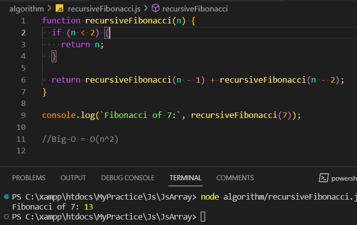

# JS Practice

This is a Practical **js** project for practicing **JavaScript**.

## Technologies

- JS
- Node

## Features

- Js Array
- Algorithms

## Installation

###### frontend

```shell
npm install

node {filename}
```

## Screenshots


